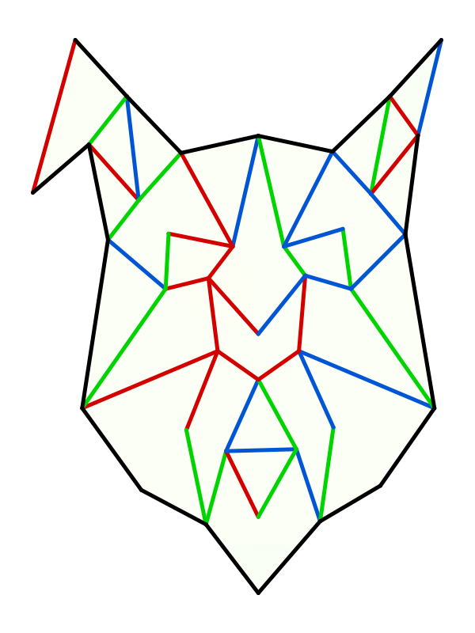

Labyrinthe Féroce
=================

Ce dépôt traite du labyrinthe Féroce (décliné en deux versions) exposé pour la première fois par le HAUM au festival Teriaki.

Règles
------

- On se déplace de case en case.
- À chaque changement de case, la couleur de passage doit être différente de la précédente.
- On entre par une oreille, on ressort par l'autre. 

Labyrinthe
----------

Voici les deux versions du labyrinthe qui ont été exposées :

.. image:: maze1.png

